# Evaluation Methodology for Vision-Language Models

**Task 2 | Internship Preparatory Submission**

---

## What is a Vision-Language Model?

Vision-Language Models (VLMs) are AI systems that integrate computer vision (CV) and natural language processing (NLP) to understand and generate text based on visual inputs. Given a satellite image and a natural language question, a VLM generates a natural language answer (text). Examples include Qwen2.5-VL, InternVL, and LLaVA (all are used in DisasterM3).

Evaluating a VLM means measuring how well its predicted answers match the correct answers across a dataset of image-question-answer triples.

---

## 1. Nature of the Data

### The Basic Unit: An Image-Question-Answer Triple

Every VLM evaluation dataset is built from the same fundamental unit:

```
(image(s), question, ground_truth_answer)
```

The model receives the image(s) and question, generates a predicted answer, and that prediction is compared against the ground truth.

In disaster analysis benchmarks, this unit is extended in several ways:

**Multiple images per question**
DisasterM3 provides pre-disaster and post-disaster satellite image pairs for most tasks. The model must reason across both images to answer questions like *"How many buildings were damaged between these two images?"*

**Temporal image sequences**
MONITRS extends this further with sequences of satellite images taken at different dates. The model must reason about change over time, not just before and after like DisasterM3.

**Structured answer sets**
Answers come in two fundamental forms, each requiring a different evaluation approach:

| Answer Type | Description | Example |
|---|---|---|
| **Closed / Multiple-choice** | The answer must be one of a fixed set of options (A, B, C, D) | "Which letter best describes the damage level? A) None B) Minor C) Major D) Destroyed" |
| **Open-ended** | The model generates free-form text with no constraints | "Describe the changes visible between the two images." |

### Dataset Splits

All three benchmarks follow standard machine learning practice of splitting data into:
- **Train** — used for model training
- **Validation** — used for tuning thresholds and hyperparameters
- **Test** — the held-out set on which final evaluation is reported

Because the framework is evaluation-only, it always runs on the test split.

---

## 2. Evaluation Metrics

The correct metric depends entirely on the answer type. Using the wrong metric gives meaningless results.

### 2.1 Metrics for Closed / Multiple-Choice Answers

#### Overall Accuracy (OA)
The most direct metric. The fraction of questions the model answered correctly.

```
Accuracy = (Number of correct predictions) / (Total number of questions)
```

Simple to compute and interpret. The main limitation is that it treats all question types equally — a model could score high accuracy by performing well only on the most common question type while failing entirely on rarer ones.

#### Per-Category Accuracy
To address the limitation above, accuracy is also computed separately for each question type or task subset. This reveals whether a model is genuinely competent across all tasks or only on easy ones.

Used in: DisasterM3 (per-subset scores), EarthVQA (per question type: Basic Judging, Reasoning-based Counting, etc.)

---

### 2.2 Metrics for Open-Ended Text Answers

When the model generates free-form text, exact matching is too strict — a correct answer phrased differently would be marked wrong. Instead, several NLP metrics measure the degree of similarity between the predicted text and the ground truth.

#### BLEU (Bilingual Evaluation Understudy)
Measures how many short sequences of words (n-grams) in the model's output appear in the reference answer. BLEU-1 counts single words, BLEU-2 counts word pairs, and so on up to BLEU-4.

```
BLEU-n = (matching n-grams in prediction) / (total n-grams in prediction)
```

BLEU is precise but can penalise correct answers that use different but valid vocabulary.

#### METEOR (Metric for Evaluation of Translation with Explicit ORdering)
An improvement over BLEU that also accounts for synonym matching and word stemming (like "flooded" matching "flood"). Generally correlates better with human judgement than BLEU alone.

#### ROUGE-L (Recall-Oriented Understudy for Gisting Evaluation)
Measures the length of the longest common subsequence between the prediction and the reference. Unlike BLEU, ROUGE-L is recall-oriented — it rewards the model for covering the key content of the reference, not just for being precise.

```
ROUGE-L = LCS(prediction, reference) / length(reference)
```

Used in: MONITRS `Evaluate/eval.py` computes all four (BLEU-1 through 4, METEOR, ROUGE-L) together.

---

### 2.3 Metrics for Counting and Quantitative Tasks

When questions ask *"How many?"* or *"What area?"*, the answer is a number, and the appropriate metric measures numerical error rather than string similarity.

#### RMSE (Root Mean Squared Error)
Measures the average magnitude of the error between predicted and true counts. Larger errors are penalised more heavily than smaller ones due to the squaring.

```
RMSE = sqrt( mean( (predicted - ground_truth)² ) )
```

Used in: EarthVQA's `Count_RMSE_Metric` for counting and area estimation questions.

---

### 2.4 Statistical Comparison Between Models

When comparing two models on the same dataset, raw accuracy numbers alone do not tell you whether one model is genuinely better or whether the difference could be due to chance. For rigorous academic benchmarking, a statistical significance test is needed.

#### McNemar's Test
Compares two models' predictions on the same set of questions. It specifically looks at the cases where one model was right and the other was wrong — not the cases where both agreed. If Model A corrects many of Model B's mistakes but Model B corrects few of Model A's, Model A is significantly better.

Used in: MONITRS `Evaluate/eval.py`.

---

### 2.5 LLM-as-Judge Evaluation

For open-ended answers, automated NLP metrics like BLEU and ROUGE can miss semantic correctness — a prediction that is factually right but worded differently from the reference may score poorly. A newer approach is to use a large language model (e.g. Gemini) to score predictions on multiple qualitative criteria.

MONITRS's `LLM_eval.py` scores each prediction on five criteria rated 0–5:

| Criterion | What it measures |
|---|---|
| Factual accuracy | Is the prediction factually correct? |
| Completeness | Does it cover all key aspects of the ground truth? |
| Specificity | Is it specific to the image, or generic? |
| Visual evidence | Does it reference concrete visual features? |
| Uncertainty handling | Does it appropriately express uncertainty? |

LLM-as-judge is more flexible and semantically aware than BLEU/ROUGE, but requires API access to a capable judge model and introduces its own biases.

---

## 3. Summary: Metric Selection by Task Type

<p align="center">
  
</p>

*Note: This diagram was generated with the assistance of AI to simplify and visually illustrate the concepts. The content and interpretation are based on my own understanding.*

| Task Type | Answer Form | Primary Metric | Secondary Metrics |
|---|---|---|---|
| Disaster type classification | Multiple-choice | Accuracy | Per-category accuracy |
| Damage assessment | Multiple-choice | Accuracy | Per-category accuracy |
| Visual QA (factual) | Multiple-choice | Accuracy | — |
| Image captioning | Open-ended text | BLEU-4, ROUGE-L | METEOR, BLEU-1/2/3 |
| Damage description | Open-ended text | ROUGE-L | BLEU-4, METEOR, LLM-judge |
| Building / road counting | Numeric | RMSE | — |
| Model-vs-model comparison | Any | McNemar's test | — |

---

## 4. How This Applies to the Evaluation Framework

The proposed modular framework must implement all of the above metric types behind a unified evaluator interface. Each dataset adapter declares which evaluator it requires (e.g. DisasterM3 subsets use accuracy; caption subsets use BLEU/ROUGE-L), and the experiment runner invokes the appropriate evaluator automatically based on the configuration file.

This avoids the current situation in DisasterM3 where no evaluation is implemented at all, and in MONITRS and EarthVQA where evaluation code exists but is tightly coupled to each dataset's specific format.