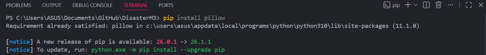
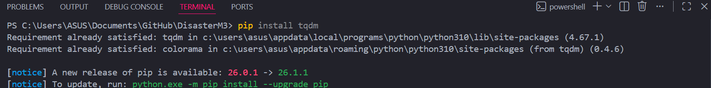
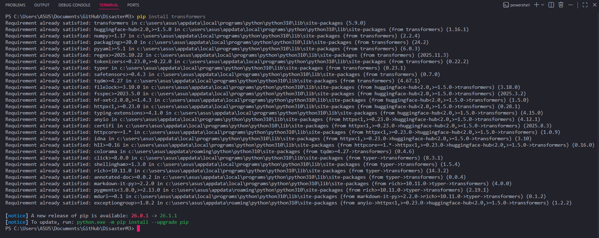
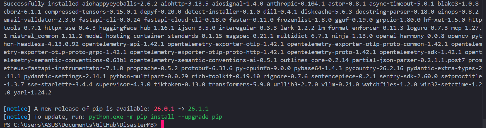

# Execution Notes — DisasterM3

**Task 4 | Internship Preparatory Submission**  
**Environment:** Windows 11, Python 3.x, NVIDIA GPU (ASUS machine)

---

## 1. Reading the README

The README provides two example commands to run the benchmark:

```bash
# Example 1 — Qwen2.5 VL
python disaster_m3/pyscripts/run_vllm.py --model_id Qwen/Qwen2.5-VL-7B-Instruct --subset bearing_body

# Example 2 — InternVL3
python disaster_m3/pyscripts/run_vllm.py --model_id OpenGVLab/InternVL3-78B --subset report
```

**Issue found immediately:** The README says to run from path `disaster_m3/pyscripts/run_vllm.py`
but the actual repository folder is named `DisasterM3-master/` and the script lives at
`pyscripts/run_vllm.py`. The path in the README does not match the actual repo structure.

**Correct command:**
```bash
python pyscripts/run_vllm.py --model_id Qwen/Qwen2.5-VL-7B-Instruct --subset bearing_body
```

**Second issue:** The README lists no dependencies, no `requirements.txt`, and no setup
instructions. There is no way to know what to install before running without reading the
source code manually.

---

## 2. Identifying Dependencies

Since no `requirements.txt` exists, dependencies were identified by reading the import
statements at the top of `pyscripts/run_vllm.py` and `models/__init__.py` directly:

**From `pyscripts/run_vllm.py`:**
```python
from PIL import Image                      # → pillow
from tqdm import tqdm                      # → tqdm
from transformers import GenerationConfig  # → transformers
from vllm import EngineArgs, LLM, SamplingParams  # → vllm
```

**From `models/__init__.py`:**
```python
import torch                               # → torch
from transformers import ...               # → transformers
```

**Full dependency list (manually extracted):**

| Package | Purpose |
|---|---|
| `vllm` | Core inference engine — runs the VLMs |
| `torch` | Deep learning backend |
| `transformers` | Model configs and tokenizers |
| `pillow` | Image loading and resizing |
| `tqdm` | Progress bar during inference |

---

## 3. Installation

Since no `requirements.txt` exists, packages were installed manually:

```bash
pip install vllm transformers pillow tqdm
```
installing pillow:
<p align="center">
  
</p>

installing tqdm:
<p align="center">
  
</p>

installing transformers:
<p align="center">
  
</p>

installing vllm:
<p align="center">
  
</p>

---

## 4. Execution Attempts

### Attempt 1: Running the script on Windows

```bash
python pyscripts/run_vllm.py --model_id Qwen/Qwen2.5-VL-7B-Instruct --subset bearing_body
```

**Error:**
```
ModuleNotFoundError: No module named 'uvloop'
```

`uvloop` is a Unix-only async event loop that `vllm` depends on internally.
It is not available on Windows. This means **vllm cannot run on Windows** regardless
of whether a GPU is present.

This is a significant undocumented limitation. The README gives no warning that
Windows is unsupported. Users on Windows machines will hit this error with no guidance.

---

### Attempt 2: Partial validation (import-level check)

To verify as much of the code as possible without vllm, the data path logic was
extracted and run independently as `validate_structure.py`:

```python
import json
import os
from os.path import join

PROJECT_ROOT = os.getcwd()
subset = "bearing_body"

subset_json = join(PROJECT_ROOT, "data", f"{subset}.json")
print(f"Looking for dataset at: {subset_json}")
print(f"File exists: {os.path.exists(subset_json)}")

images_dir = join(PROJECT_ROOT, "data", "images")
print(f"Looking for images at: {images_dir}")
print(f"Directory exists: {os.path.exists(images_dir)}")
```

**Output:**
```
Looking for dataset at: C:\Users\ASUS\Documents\GitHub\DisasterM3\data\bearing_body.json
File exists: False
Looking for images at: C:\Users\ASUS\Documents\GitHub\DisasterM3\data\images
Directory exists: False
```

This confirms two things:
1. The expected data paths are correct — the script looks for `data/{subset}.json` and `data/images/`
2. The dataset files are not included in the repository and must be requested separately via
   the Google Form linked in the README (`https://forms.gle/APQpmyuThh28HsJdA`).
   The README does not mention this data download step before the run commands.

---

## 5. Summary of Issues Encountered

| # | Issue | Severity |
|---|---|---|
| 1 | Wrong script path in README | Minor |
| 2 | No `requirements.txt` in repo | Moderate |
| 3 | No installation instructions in README | Moderate |
| 4 | `vllm` does not support Windows (`uvloop` missing) | **Blocking on Windows** |
| 5 | Dataset files not included in repo | **Blocking** |
| 6 | Dataset download step not mentioned before run commands | Moderate |
| 7 | No minimum hardware/OS requirements stated | Moderate |
| 8 | No evaluation step — script produces raw predictions only | Informational |

---

## 6. What a Successful Run Requires

A complete run requires all of the following:

- **Linux or WSL2** — vllm does not support Windows natively
- **NVIDIA GPU with CUDA** — minimum ~16GB VRAM for the 7B Qwen model
- **Dataset files** — requested via Google Form, placed at `data/{subset}.json` and `data/images/`
- **Model weights** — downloaded automatically from HuggingFace on first run (~14GB for 7B)

Expected successful execution flow:
```bash
# On Linux / WSL2, with GPU and dataset in place:
python pyscripts/run_vllm.py \
    --model_id Qwen/Qwen2.5-VL-7B-Instruct \
    --subset bearing_body \
    --batch_size 4

# Results saved to:
# results/bearing_body/Qwen--Qwen2.5-VL-7B-Instruct/finished.jsonl
```

---

## 7. Recommended README Updates

The following **Setup** section should be added to the README before the benchmark commands:

```markdown
## Setup

### Requirements
- Linux or WSL2 (vllm does not support Windows natively)
- Python 3.8+
- NVIDIA GPU with CUDA support (minimum 16GB VRAM for 7B models)
- CUDA 11.8 or higher

### Installation
\`\`\`bash
pip install vllm transformers pillow tqdm
\`\`\`

> **Note:** A `requirements.txt` will be added in a future update.

### Dataset
Request dataset access via the [Google Form](https://forms.gle/APQpmyuThh28HsJdA).
After approval, place the files as follows:
\`\`\`
DisasterM3/
└── data/
    ├── bearing_body.json
    ├── building_damage_counting.json
    ├── disaster_type.json
    ├── ... (other subset JSONs)
    └── images/
        └── ... (satellite image files)
\`\`\`
```