# Vision Tasks in Computer Vision

**Task 1 | Internship Preparatory Submission**

---

## The Three Core Tasks

Computer vision models can be applied to images in three fundamentally different ways, each answering a different question about what is in an image.

### Classification — *What does the image show?*

Classification assigns a single label to an entire image. The model looks at the whole scene and outputs one category from a fixed set of categories. It does not say *where* anything is, only *what* the image is. 

**Input:** An image  
**Output:** A single label (e.g. "flood", "wildfire", "no damage")  
**Metric:** Accuracy, top-k accuracy

**Example:** Given a satellite image, output one of `{flood, earthquake, wildfire, hurricane, no_disaster}`.

---

### Detection — *What is here, and where exactly is it?*

Detection finds individual objects and draws a bounding box around each one. The model must both recognise the category of each object (same as classification) and localise it within the image using a rectangular region defined by coordinates.

**Input:** An image  
**Output:** A list of `(label, bounding_box, confidence_score)` tuples  
**Metric:** Mean Average Precision (mAP), Intersection over Union (IoU)

**Example:** Given a post-disaster aerial image, output boxes around each collapsed building, each intact building, and each flooded road segment.

---

### Segmentation — *What is here, where exactly, and at what shape?*

Segmentation assigns a category label to every individual pixel in the image. Instead of a box, each object gets a precise pixel-level mask. This is the most information-rich and computationally demanding of the three tasks.

There are two common variants:
- **Semantic segmentation**: every pixel gets a class label; instances of the same class are not distinguished (all roads are "road")
- **Instance segmentation**: every individual object gets its own separate mask (building #1, building #2, etc...)

**Input:** An image  
**Output:** A full-resolution mask where each pixel has a class label  
**Metric:** Mean Intersection over Union (mIoU), pixel accuracy

**Example:** Given a satellite image, produce a pixel map showing which areas are road, building, water, vegetation, barren land, or agriculture (used in EarthVQA).

---
## Explanation diagram

  

*Note: This diagram was generated with the assistance of AI to simplify and visually illustrate the concepts. The content and interpretation are based on my own understanding.*

---

## In the Context of Natural Disasters

These three tasks take on specific meanings when applied to disaster-related satellite imagery. The table below maps each task to concrete disaster analysis use cases.

| Task | Disaster Application | Example Output |
|---|---|---|
| **Classification** | Identify the type of disaster in an image | "This is a flood event" |
| **Classification** | Damage level assessment per image | "Severe damage" / "Moderate" / "No damage" |
| **Detection** | Locate collapsed vs. standing buildings | Bounding boxes around each building with damage label |
| **Detection** | Find blocked roads or damaged bridges | Boxes localising infrastructure damage |
| **Segmentation** | Map flooded area extent at pixel level | Flood water vs. dry land per pixel |
| **Segmentation** | Land-use change monitoring | Pre/post disaster masks showing destroyed vegetation |
| **Segmentation** | Search and rescue zone mapping | Pixel masks of accessible vs. blocked areas |
